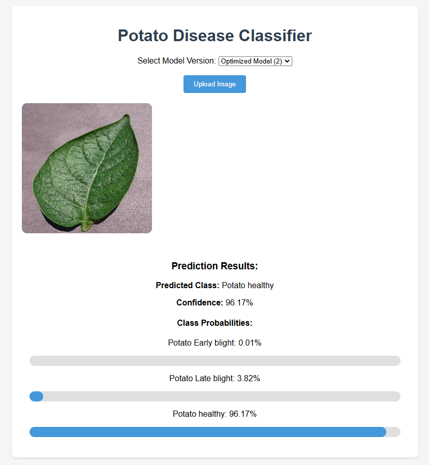

# Potato Disease Classifier

This repository contains a FastAPI application that classifies **Potato Leaf** images into three categories:
- **Potato___Early_blight**
- **Potato___Late_blight**
- **Potato___healthy**

It includes two TensorFlow/Keras models:

1. **Base Model (1)**
2. **Optimized Model (2)**

## Overview

I developed a Potato Disease Classifier that uses two deep learning models (Base and Optimized) to identify Early Blight, Late Blight, or healthy potato leaves. The project is built with Python, TensorFlow, and FastAPI, and it includes a user-friendly frontend for image uploads. After containerizing the application with Docker, I deployed it on Google Cloud Run for easy scalability and near-zero cost hosting.
For those interested in a scalable production approach, an alternative version of the project that uses TensorFlow Serving to host three models (Base, Transfer Learning, and Optimized) is provided in the repository. Details for this variant can be found at the end of the README file.

- **Goal**: Quickly diagnose potato leaf diseases (or confirm health) using deep learning.
- **Models**: Trained with TensorFlow. The “Base Model” is simpler; the “Optimized Model” applies additional tuning.
- **Frontend**: A simple HTML/JS interface (`index.html`) for uploading images and displaying predictions.

## Dataset

The training data is from [this Kaggle dataset](https://www.kaggle.com/datasets/faysalmiah1721758/potato-dataset).  
Please visit the link to download the images if you’d like to replicate or retrain the models.

**Note**: We do **not** include the raw dataset in this repo to keep the project size manageable.

## Screenshots

Inside the `screenshots/` folder, you’ll find images illustrating the application in action:

| Base Model (1)                                                                 | Optimized Model (2)                                                                  |
|--------------------------------------------------------------------------------|--------------------------------------------------------------------------------------|
|      |       |


These show how the app looks when classifying a healthy potato leaf.

## Live Demo

A live version is deployed on **Google Cloud Run** at:  
[https://potato-api-443221614300.us-central1.run.app/](https://potato-api-443221614300.us-central1.run.app/)

Upload an image, select a model version, and see classification results.

## Project Structure

    ```plaintext
      .
      ├── api/
      │   ├── main.py
      │   └── frontend/
      │       └── index.html
      ├── models/
      │   ├── base.h5
      │   └── optimized.h5
      ├── screenshots/
      │   ├── Screenshot2025-03-05_083655.png
      │   └── Screenshot2025-03-05_083549.png
      ├── training/
      │   ├── training_base.ipynb
      │   └── training_optimized.ipynb
      ├── Dockerfile
      ├── requirements.txt
      └── README.md

- **api/main.py**: FastAPI logic (endpoints for image upload & inference).
- **models/**: Folder with pre-trained `.h5` files (base & optimized).
- **screenshots/**: UI screenshots.
- **index.html**: Frontend for uploading images.
- **training_base.ipynb**, **training_optimized.ipynb**: Jupyter notebooks to train each model.
- **requirements.txt**: Python dependencies (TensorFlow, FastAPI, etc.).

## Running Locally

1. **Clone** this repo:
   ```bash
   git clone https://github.com/hussinxx700/potato-disease-classifier.git
   cd potato-disease-classifier

2. Create a Python virtual environment **(recommended)**:
   ```bash
   python -m venv venv
   source venv/bin/activate  # or venv\Scripts\activate on Windows

1. Install Dependencies:
   ```bash
   pip install -r requirements.txt

1. Start the FastAPI App:
   ```bash
   python api/main.py

By default, it listens on 127.0.0.1:8080.
Open http://127.0.0.1:8080 in your browser to view the interface.

## Docker Usage

1. Build the Docker image
   ```bash
   docker build -t potato_api:v1 .

2. Run the container, mapping port 8080
   ```bash
    docker run -d -p 8080:8080 potato_api:v1

## Google Cloud Run Deployment

1. Build with Cloud Build
   ```bash
   gcloud builds submit --tag gcr.io/<PROJECT_ID>/potato_api:v1 .

2. Deploy
   ```bash
   gcloud run deploy potato-api \
     --image gcr.io/<PROJECT_ID>/potato_api:v1 \
     --platform managed \
     --region us-central1 \
     --allow-unauthenticated


## Alternative Version (TF Serving)

An alternative version of this project uses **TensorFlow Serving** to host **three models**:
- **Base Model**
- **Transfer Learning Model**
- **Optimized Model**

In this variant, the application leverages a TF Serving configuration file (`models.config.a`) to manage multiple models and version labels. The deployment is designed using a multi-container architecture:
- One container runs the **FastAPI** application (handling API endpoints, image preprocessing, and the user interface).
- A separate container runs **TensorFlow Serving** (hosting the three models and managing inference requests).

Although this version was not deployed to production, it demonstrates a scalable approach where models and the API can be updated independently.

### Running Locally (TF Serving Alternative)

1. **Navigate to the project folder** (assuming your folder structure has a `serving` directory):
   ```powershell
   cd project_folder\serving

2. Build and run the TensorFlow Serving container:
   ```powershell
   docker build -f Dockerfile.tf -t potato_tf_serving:v1 .
   docker run -d -p 8501:8501 --name potato_tf_container potato_tf_serving:v1

3. Build and run the FastAPI container:
   ```powershell
   docker build -f Dockerfile.api -t potato_api:v1 .
   docker run -d -p 8000:8000 --name potato_api_container potato_api:v1

After running these commands, the TensorFlow Serving container will listen on port 8501 and host the three models, while the FastAPI container (which interfaces with TF Serving) will listen on port 8000. You can access the FastAPI application at http://localhost:8000 in your browser to test this alternative setup.
